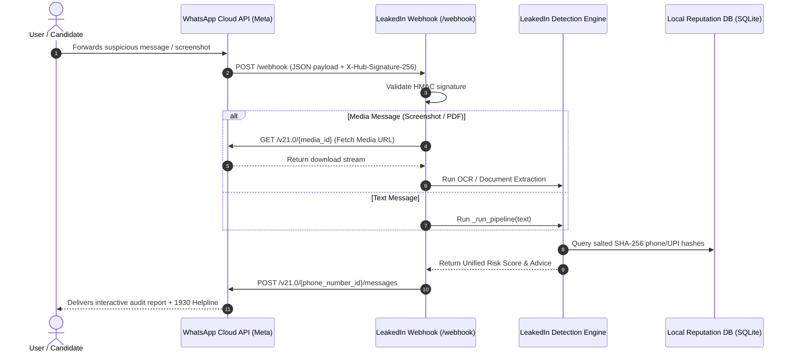

# 📱 WhatsApp Cloud API Integration Architecture

> **Technical Architecture & Implementation Specification**  
> How to deploy LeakedIn as a free WhatsApp security bot using the Meta WhatsApp Business Cloud API.

---

## 1. Executive Summary & Problem Context
In India, over **80% of recruitment scams** originate on or redirect to WhatsApp. Scammers send unsolicited WhatsApp messages claiming to represent global employers (Amazon, Google, TCS) with promises of *\"₹3,000–₹5,000 per day for part-time data entry\"*, then demand advance registration fees via UPI or steal Aadhaar/PAN copies.

Providing an automated WhatsApp bot enables users to simply **forward suspicious messages or screenshots** inside their existing messaging workflow without needing to open a separate website or app.

---

## 2. Architecture Overview



---

## 3. Webhook Specification

### 3.1 Webhook Verification (`GET /webhook`)
Meta verifies webhook servers during initial configuration via a challenge-response handshake:

```python
from fastapi import APIRouter, Request, Query, Response

router = APIRouter()
VERIFY_TOKEN = os.getenv("WHATSAPP_VERIFY_TOKEN", "leakedin_secure_verify_token")

@router.get("/webhook")
async def verify_webhook(
    hub_mode: str = Query(None, alias="hub.mode"),
    hub_token: str = Query(None, alias="hub.verify_token"),
    hub_challenge: str = Query(None, alias="hub.challenge"),
):
    if hub_mode == "subscribe" and hub_token == VERIFY_TOKEN:
        return Response(content=hub_challenge, media_type="text/plain")
    return Response(content="Forbidden", status_code=403)
```

### 3.2 Ingress Event Handler (`POST /webhook`)
Validates the HMAC-SHA256 signature using the Meta App Secret, extracts the incoming message, runs the LeakedIn detection pipeline, and replies asynchronously:

```python
import hmac
import hashlib
import requests
from backend.app.api.routes import _run_pipeline
from backend.app.utils.ocr import extract_text_from_image

WHATSAPP_TOKEN = os.getenv("WHATSAPP_CLOUD_API_TOKEN")
PHONE_NUMBER_ID = os.getenv("WHATSAPP_PHONE_NUMBER_ID")
APP_SECRET = os.getenv("WHATSAPP_APP_SECRET")

@router.post("/webhook")
async def handle_whatsapp_message(request: Request):
    # 1. Validate X-Hub-Signature-256
    raw_body = await request.body()
    signature = request.headers.get("X-Hub-Signature-256", "").replace("sha256=", "")
    expected = hmac.new(APP_SECRET.encode(), raw_body, hashlib.sha256).hexdigest()
    if not hmac.compare_digest(signature, expected):
        return Response(status_code=401)

    payload = await request.json()
    entry = payload.get("entry", [])[0]
    changes = entry.get("changes", [])[0]
    value = changes.get("value", {})
    messages = value.get("messages", [])

    if not messages:
        return {"status": "ok"}

    msg = messages[0]
    sender_id = msg["from"]
    msg_type = msg.get("type")

    extracted_text = ""
    if msg_type == "text":
        extracted_text = msg["text"]["body"]
    elif msg_type == "image":
        media_id = msg["image"]["id"]
        # Fetch media URL from Meta Graph API
        media_res = requests.get(
            f"https://graph.facebook.com/v21.0/{media_id}",
            headers={"Authorization": f"Bearer {WHATSAPP_TOKEN}"}
        ).json()
        img_bytes = requests.get(
            media_res["url"],
            headers={"Authorization": f"Bearer {WHATSAPP_TOKEN}"}
        ).content
        extracted_text = extract_text_from_image(img_bytes)

    if extracted_text:
        # 2. Run shared LeakedIn Pipeline
        res = _run_pipeline(extracted_text)

        # 3. Format and dispatch WhatsApp response
        score = res["risk_score"]
        emoji = "🚨" if score > 75 else ("🟠" if score > 50 else ("🟡" if score > 25 else "✅"))
        
        reply_text = (
            f"{emoji} *LEAKEDIN AUDIT REPORT*\n"
            f"• *Threat Score:* {score}/100 ({res['risk_level']})\n"
            f"• *Verdict:* {res['verdict']}\n\n"
            f"🚩 *Top Red Flags:*\n" +
            "\n".join([f"• {f['category']}: {f.get('matched_text','')}" for f in res.get('rule_matches', [])[:3]]) +
            "\n\n🚨 *Need help?* Dial national helpline *1930* or visit cybercrime.gov.in"
        )

        requests.post(
            f"https://graph.facebook.com/v21.0/{PHONE_NUMBER_ID}/messages",
            headers={
                "Authorization": f"Bearer {WHATSAPP_TOKEN}",
                "Content-Type": "application/json"
            },
            json={
                "messaging_product": "whatsapp",
                "to": sender_id,
                "type": "text",
                "text": {"body": reply_text}
            }
        )

    return {"status": "success"}
```

---

## 4. Privacy & Zero-Retention Compliance
1. **In-Memory Streaming**: Downloaded audio, media files, and message texts exist strictly as ephemeral in-memory byte buffers (`io.BytesIO`) during OCR and feature extraction.
2. **Zero Storage**: Raw candidate chat history, victim phone numbers, and profile photos are never persisted to disk or databases.
3. **Identifier Redaction**: When an entity match is added to the community blacklist (`reputation.db`), only a one-way cryptographically salted SHA-256 hash is recorded.

---

## 5. Free Developer Sandbox Setup (No Business Solution Provider Fees)
Developers can run this pipeline completely for free using Meta's Cloud API Sandbox:
1. Create a free developer account at [developers.facebook.com](https://developers.facebook.com).
2. Create an App of type **\"Business\"** and select **WhatsApp**.
3. Under WhatsApp > **API Setup**, obtain:
   - Temporary Access Token (`WHATSAPP_CLOUD_API_TOKEN`)
   - Test Phone Number ID (`WHATSAPP_PHONE_NUMBER_ID`)
4. Configure your Webhook URL using ngrok or a free cloud host:
   ```bash
   ngrok http 8000
   # Set Webhook URL: https://<ngrok-id>.ngrok-free.app/webhook
   ```
5. Add your recipient phone number to the sandbox whitelist to send and receive free test scans.
